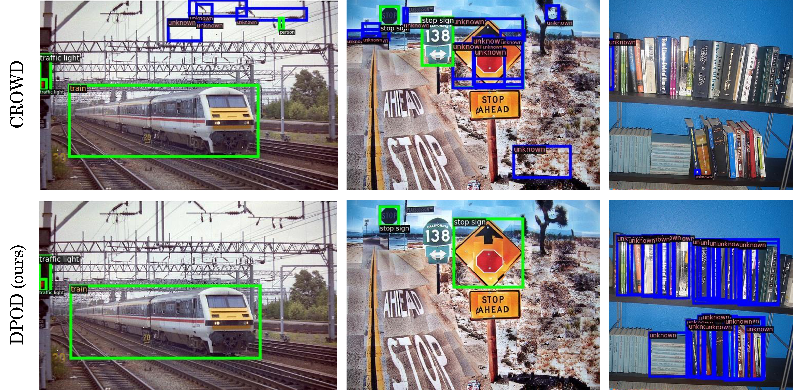

# <p align="center"> [ECCV 2026] Towards Sparsely Annotated Open-World Object Detection </p>

<p align="center"> HeeJu Han, AJeong Kim, Jinsun Park </p>

## Overview
Real-world object detection operates under ambiguous supervision, where unlabeled regions may correspond to missing annotations of known objects or genuinely unknown categories. These challenges have been addressed separately in Sparsely Annotated Object Detection (SAOD) and Open-World Object Detection (OWOD). In practice, their co-occurrence remains an open problem. To address this problem, we introduce Sparsely Annotated Open-World Object Detection
(SA-OWOD), a new task that jointly considers sparse supervision and the presence of unseen categories

<p align="center">  </p>

We propose Dual-Perspective Object Discovery (DPOD), a unified framework that jointly models unlabeled known and unknown instances via two complementary mechanisms. The Known Target Recovery Module (KTRM) recovers supervision for unlabeled known instances and explicitly regularizes the feature space to separate known and unknown representations. Complementarily, the Dual-Disagreement Target Generator (DDTG) identifies reliable unknown candidates through cross-view semantic inconsistency. By integrating these modules, DPOD resolves contradictory supervision signals caused by ambiguous unlabeled regions. 

<p align="center">  </p>

As a result, it prevents misclassification between known and unknown objects and stabilizes the decision boundaries. Experimental results on sparsely annotated open-world benchmarks demonstrate that the proposed method outperforms existing open-world detection methods, particularly in detecting unknown objects.

<p align="center">  </p>


## Requirements
- Linux or macOS with Python ≥ 3.8.
- Install [PyTorch](https://pytorch.org/get-started/locally/) ≥ 1.9.0, [Detectron2](https://github.com/facebookresearch/detectron2), timm, pandas, opencv, and einops.


## Data Preparation
### 1. Download Datasets
* **Original Images:** Download the official images from [MS COCO](https://cocodataset.org/#download) and [PASCAL VOC](https://www.robots.ox.ac.uk/~vgg/projects/pascal/VOC/).
* **Sparse Annotations:** Download our custom sparse annotations from [Google Drive](https://drive.google.com/drive/folders/1KhiGu9Y7_ws6NO-O1kxAAl2NMPemRgy2?usp=drive_link).

> **Note:** Please place all images (both VOC and COCO) into the `JPEGImages/` directory as required by the dataset loader.

### 2. Directory Structure
Organize your `datasets/` folder as follows: 

```text
datasets/
├── Annotations/
│   ├── easy/                   # Sparse annotation split (e.g., easy, hard, coco50miss)
│   │   └── *.xml
│   └── hard/
│       └── *.xml
├── ImageSets/                  # Split files defining task settings
│   ├── test.txt
│   ├── t1.txt
│   ├── t2.txt
│   ├── t2_ft.txt
│   └── t3.txt
└── JPEGImages/                 # Combined folder for all PASCAL VOC & COCO images
    ├── 000001.jpg
    ├── 000002.jpg
    └── ...
```

## Getting Started
- Training for sparsely annotated open-world object detection:
    ```bash
    bash run_saowod.sh
    ```
- Evaluation for sparsely annotated open-world object detection:
    ```bash
    bash test_saowod.sh
    ```

## Model Results

<p align="center">
    <table>
    <thead>
        <tr>
        <th rowspan="2">Set</th>
        <th colspan="2">Task 1</th>
        <th colspan="2">Task 2</th>
        <th colspan="2">Task 3</th>
        <th>Task 4</th>
        </tr>
        <tr>
        <th>K-mAP</th>
        <th>U-Recall</th>
        <th>K-mAP</th>
        <th>U-Recall</th>
        <th>K-mAP</th>
        <th>U-Recall</th>
        <th>K-mAP</th>
        </tr>
    </thead>
    <tbody>
        <tr>
        <td><b> <a href="https://drive.google.com/drive/folders/1TNNALzK74Yhy0LvkK5mlXP-qgtG6LkAA?usp=sharing">Easy</a></b></td>
        <td>56.48</td>
        <td>55.34</td>
        <td>39.53</td>
        <td>52.47</td>
        <td>36.90</td>
        <td>63.68</td>
        <td>32.15</td>
        </tr>
        <tr>
        <td><b> <a href="https://drive.google.com/drive/folders/19UoBYMBXXEZCz5K5fgZ_z4cqNL_8wOdR?usp=sharing">Hard</a></b></td>
        <td>54.09</td>
        <td>51.85</td>
        <td>33.36</td>
        <td>48.25</td>
        <td>35.79</td>
        <td>64.00</td>
        <td>31.15</td>
        </tr>
        <tr>
        <td><b> <a href="https://drive.google.com/drive/folders/1Rx1CBu-qHxAvUfhf2rywEQEVbg0SArgJ?usp=sharing">Coco50missp</a></b></td>
        <td>53.78</td>
        <td>51.39</td>
        <td>30.73</td>
        <td>47.69</td>
        <td>30.90</td>
        <td>59.00</td>
        <td>24.74</td>
        </tr>
        <tr>
        <td><b> <a href="https://drive.google.com/drive/folders/14VSqzMA8C2bGOTfqHtnV8ATlZg8De38o?usp=sharing">Keep1</a></b></td>
        <td>47.97</td>
        <td>48.03</td>
        <td>33.09</td>
        <td>48.28</td>
        <td>32.37</td>
        <td>52.22</td>
        <td>28.21</td>
        </tr>
        <tr>
        <td><b> <a href="https://drive.google.com/drive/folders/1LKI4Dmn_LXBm6Y4RtOkDPL8jAHPA6lBe?usp=sharing">Extreme</a></b></td>
        <td>45.37</td>
        <td>45.56</td>
        <td>25.98</td>
        <td>44.32</td>
        <td>26.58</td>
        <td>57.53</td>
        <td>20.19</td>
        </tr>
    </tbody>
    </table>
</p>


## Acknowledgement
This repository is built on reusing codes of [CROWD](https://github.com/amajee11us/CROWD), [CoStudent](https://github.com/hustvl/CoStudent). We are quite grateful for them.